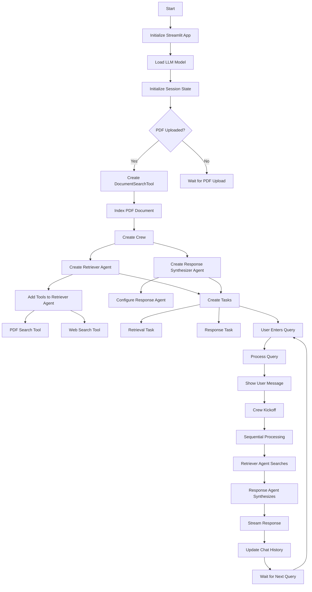

# 🤖 Agentic RAG using CrewAI

A powerful Retrieval-Augmented Generation (RAG) system built with CrewAI that intelligently searches through documents and falls back to web search when needed. Features local LLM support with deep-seek-r1 or llama 3.2!

## 🌟 Features

- 📚 Document-based search with RAG capabilities
- 🌐 Automatic fallback to web search
- 🤖 Local LLM support (deep-seek-r1 or llama 3.2)
- 🔄 Seamless integration with CrewAI
- 💨 Fast and efficient document processing
- 🎯 Precise answer synthesis

## 🔄 System Flow

Below is the detailed flow diagram of how the system processes queries and generates responses:

## 🛠️ System Architecture

The system consists of two main agents:

1. **Retriever Agent**:
   - Handles document searching
   - Manages web search fallback
   - Uses both PDF and web search tools

2. **Response Synthesizer Agent**:
   - Processes retrieved information
   - Generates coherent responses
   - Ensures context relevance

## 📚 Usage Examples

1. **Document Search**:
   - Upload your PDF document
   - Enter your query
   - Receive contextual answers from the document

2. **Web Search Fallback**:
   - System automatically detects when document search isn't sufficient
   - Seamlessly switches to web search
   - Combines information from multiple sources
